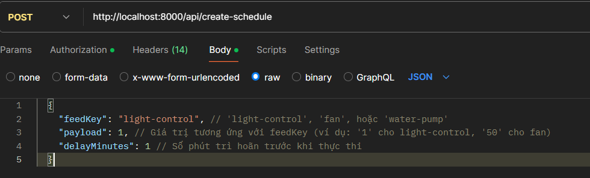

# BE docs

## BaseURLs

`http://localhost:8000/api`

`https://dadn-2.onrender.com/api`


## Endpoints

### 1. Đăng Ký Người Dùng

- **URL:** `/register`
- **Phương thức:** `POST`
- **Mô tả:** Đăng ký người dùng mới.
- **Nội dung yêu cầu:**
  ```json
  {
    "username": "string",
    "password": "string"
  }
  ```
- **Phản hồi:**
  - `200 OK`: Đăng ký người dùng thành công.
  - `409 Conflict`: Tên người dùng đã tồn tại.
  - `400 Bad Request`: Thiếu tên người dùng hoặc mật khẩu.
  - `500 Internal Server Error`: Lỗi server.
- Khi đăng nhập thành công, sẽ có một token trả về. Mọi người lưu token này để đính kèm vào header của request khi fetch API.

### 2. Đăng Nhập Người Dùng

- **URL:** `/login`
- **Phương thức:** `POST`
- **Mô tả:** Đăng nhập.
- **Nội dung yêu cầu:**
  ```json
  {
    "username": "string",
    "password": "string"
  }
  ```
- **Phản hồi:**
  - `200 OK`: Đăng nhập thành công.
  - `401 Unauthorized`: Mật khẩu không chính xác.
  - `409 Conflict`: Không tìm thấy tên người dùng.
  - `400 Bad Request`: Thiếu tên người dùng hoặc mật khẩu.
  - `500 Internal Server Error`: Lỗi server.

### 3. Đổi mật khẩu

- **URL:** `/changePassword`
- **Phương thức:** `POST`
- **Mô tả:** Đổi mật khẩu ứng với username gửi về.
- **Nội dung yêu cầu:**
  ```json
  {
    "username": "string",
    "password": "string",
    "newpassword": "string",
  }
  ```

***Yêu cầu token ở header của request.***

- **Phản hồi:**
  - `200 OK`: Đổi mật khẩu thành công.
  - `401 Unauthorized`: Mật khẩu không chính xác.
  - `409 Conflict`: Không tìm thấy tên người dùng.
  - `400 Bad Request`: Thiếu tên người dùng hoặc mật khẩu.
  - `500 Internal Server Error`: Lỗi server.

### 4. Lấy Dữ Liệu Nhiệt Độ Từ Adafruit

- **URL:** `/adafruit-thermal-data`
- **Phương thức:** `GET`
- **Mô tả:** Lấy dữ liệu nhiệt độ từ Adafruit.
- **Phản hồi:**
  - `200 OK`: Trả về dữ liệu nhiệt độ.
  - `500 Internal Server Error`: Lỗi server.

***Yêu cầu token ở header của request.***

### 5. Lấy Dữ Liệu Đèn Từ Adafruit

- **URL:** `/adafruit-light-data`
- **Phương thức:** `GET`
- **Mô tả:** Lấy dữ liệu đèn từ Adafruit.
- **Phản hồi:**
  - `200 OK`: Trả về dữ liệu đèn.
  - `500 Internal Server Error`: Lỗi server.

***Yêu cầu token ở header của request.***

### 6. Lấy Dữ Liệu Độ Ẩm Đất Từ Adafruit

- **URL:** `/adafruit-earth-humid-data`
- **Phương thức:** `GET`
- **Mô tả:** Lấy dữ liệu độ ẩm đất từ Adafruit.
- **Phản hồi:**
  - `200 OK`: Trả về dữ liệu độ ẩm đất.
  - `500 Internal Server Error`: Lỗi server.

***Yêu cầu token ở header của request.***

### 7. Lấy Dữ Liệu Độ Ẩm Không Khí Từ Adafruit

- **URL:** `/adafruit-humid-data`
- **Phương thức:** `GET`
- **Mô tả:** Lấy dữ liệu độ ẩm không khí từ Adafruit.
- **Phản hồi:**
  - `200 OK`: Trả về dữ liệu độ ẩm không khí.
  - `500 Internal Server Error`: Lỗi server.

***Yêu cầu token ở header của request.***

## Ví dụ fetch data (ReactJS)

Fetch data nhiệt độ:

```javascript
const [adafruitData, setAdafruitData] = useState([]);

const API = `${BaseURL}/adafruit-thermal-data`;

async function fetchAdafruitData() {
  try {
    const response = await fetch(API,
        headers: {
          Authorization: `Bearer ${token}`,
        },
    );
    if (!response.ok) {
      throw new Error(`HTTP error! status: ${response.status}`);
    }
    const data = await response.json();
    setAdafruitData(data);
  } catch (error) {
    console.error('Error fetching Adafruit data:', error);
  }
}

useEffect(() => {
  fetchAdafruitData();
}, []);
```

Hiển thị data:
```jsx
<div className="adafruit-component-content">
  {adafruitData ? (
    <pre>{JSON.stringify(adafruitData, null, 2)}</pre>
    ) : (
    <p>Loading Adafruit data...</p>
  )}
</div>
```

### 8. Điều khiển quạt

- **URL:** `/device/fan`
- **Phương thức:** `POST`
- **Mô tả:** Gửi giá trị điều khiển mới cho quạt.
- **Nội dung yêu cầu:**
  ```json
  {
    "value": "string" // Giá trị từ "0" đến "100"
  }
  ```
- **Phản hồi:**
  - `200 OK` hoặc `201 Created`: Gửi lệnh thành công. Có thể trả về dữ liệu vừa tạo.
    ```json
    { "id": "...", "value": "75", "feed_id": "...", "feed_key": "fan", "..." }
    ```
  - `400 Bad Request`: Giá trị không hợp lệ hoặc thiếu.
  - `500 Internal Server Error`: Lỗi server hoặc lỗi khi gửi lên Adafruit.

***Yêu cầu token ở header của request.***


### 9. Điều khiển bơm

- **URL:** `/device/water-pump`
- **Phương thức:** `POST`
- **Mô tả:** Gửi giá trị điều khiển mới cho máy bơm.
- **Nội dung yêu cầu:**
  ```json
  {
    "value": "string" // Giá trị từ "0" đến "100"
  }
  ```
- **Phản hồi:** Tương tự mục 8.

***Yêu cầu token ở header của request.***


### 10. Điều khiển đèn

- **URL:** `/device/light-control`
- **Phương thức:** `POST`
- **Mô tả:** Gửi giá trị điều khiển mới cho đèn (Bật/Tắt).
- **Nội dung yêu cầu:**
  ```json
  {
    "value": "string" // Giá trị là "1" (ON) hoặc "0" (OFF)
  }
  ```
- **Phản hồi:** Tương tự mục 8.

***Yêu cầu token ở header của request.***


## Ví dụ gửi lệnh điều khiển đèn (ReactJS)

Gửi lệnh bật đèn:

```javascript
const API = `${BaseURL}/device/light-control`;
const token = localStorage.getItem("token");

async function turnLightOn() {
  try {
    const response = await fetch(API, {
      method: 'POST',
      headers: {
        'Content-Type': 'application/json',
        'Authorization': `Bearer ${token}`,
      },
      body: JSON.stringify({ value: '1' }), // Gửi giá trị '1' để bật
    });

    if (!response.ok) {
      const errorBody = await response.text();
      throw new Error(`HTTP error! status: ${response.status} - ${errorBody}`);
    }

    const result = await response.json();
    console.log('Light control success:', result);
  } catch (error) {
    console.error('Error controlling light:', error);
  }
}
```

### 11. Tạo Lịch Trình (Schedule)

- **URL:** `/create-schedule`
- **Phương thức:** `POST`
- **Mô tả:** Tạo một lịch trình mới để thực thi một hành động sau một khoảng thời gian.
- **Nội dung yêu cầu:**
  ```json
  {
    "feedKey": "string",
    "payload": number,
    "delayMinutes": number
  }
  ```
  ***feedkey***: `light-control`, `fan` hoặc `water-pump`
- **Phản hồi:**
  - `201 Created`: Lịch trình tạo thành công.
    ```json
    {
      "message": "Schedule created successfully",
      "scheduleId": number // ID của lịch trình vừa tạo
    }
    ```
  - `400 Bad Request`: Thiếu trường bắt buộc hoặc `delayMinutes` không hợp lệ.
  - `401 Unauthorized`: Token không hợp lệ hoặc thiếu.
  - `500 Internal Server Error`: Lỗi server khi tạo lịch trình.



***Yêu cầu token ở header của request.***

### 12. Cập Nhật Trạng Thái Lịch Trình

- **URL:** `/update-schedule`
- **Phương thức:** `POST`
- **Mô tả:** Cập nhật trạng thái của một lịch trình cụ thể (ví dụ: từ 'PENDING' sang 'CANCELLED').
- **Nội dung yêu cầu:**
  ```json
  {
    "taskId": number, // ID của lịch trình cần cập nhật
    "status": "string" // Trạng thái mới (ví dụ: 'CANCELLED', 'COMPLETED', 'FAILED')
  }
  ```
- **Phản hồi:**
  - `200 OK`: Cập nhật trạng thái thành công.
    ```json
    {
      "message": "Task status updated successfully"
    }
    ```
  - `400 Bad Request`: Thiếu `taskId` hoặc `status`.
  - `500 Internal Server Error`: Lỗi server khi cập nhật.

***Yêu cầu token ở header của request.***


<!-- ### 13. Lấy Danh Sách Lịch Trình Đang Chờ (Optional)

- **URL:** `/get-schedule`
- **Phương thức:** `GET`
- **Mô tả:** Lấy danh sách các lịch trình đang ở trạng thái 'PENDING' và có thời gian thực thi đã qua.
- **Phản hồi:**
  - `200 OK`: Trả về danh sách các task đang chờ.
    ```json
    [
      {
        "id": number,
        "user_id": number,
        "feed_key": "string",
        "payload": "string",
        "execute_at": "timestamp",
        "status": "PENDING",
        "created_at": "timestamp",
        "updated_at": "timestamp"
      },
      // ... more tasks
    ]
    ```
  - `500 Internal Server Error`: Lỗi server.

***Yêu cầu token ở header của request.*** -->